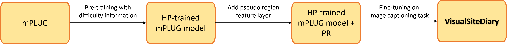

# VisualSiteDiary
An image captioning model built upon a pretrained ViT model (mPLUG) that provides human-readable captions to decipher daily progress and work activities from construction photologs
## Introduction
This paper presents VisualSiteDiary, a Vision Transformer-based image captioning model which creates human-readable captions for daily progress and work activity log, and enhances image retrieval tasks. As a model for deciphering construction photologs, VisualSiteDiary incorporates pseudo-region features, utilizes high-level knowledge in pretraining, and fine-tunes for diverse captioning styles. To validate VisualSiteDiary, a new image captioning dataset, VSD, is presented. This dataset includes many realistic yet challenging cases commonly observed in commercial building projects. Experimental results using five different metrics demonstrate that VisualSiteDiary provides superior-quality captions compared to the state-of-the-art image captioning models. 
 


## Pre-trained models and datasets

* Pre-trained models
  * We provide trained VisualSiteDiary checkpoints for convenience.
 
|Model | Visual Backbone | Image Enc Layers |  Text Dec Layers | Download |
|------------------------|-------------------------------------------|------|------|-----|
|visualsitediary.total | [vit-b-16](https://alice-open.oss-cn-zhangjiakou.aliyuncs.com/mPLUG/ViT-B-16.tar) | 12 | 12 | [visualsitediary.total](https://drive.google.com/file/d/1CmEpPnHGS-pZw7XFi3WUokcmeuvhA5ib/view?usp=sharing) |
|visualsitediary.compact | [vit-b-16](https://alice-open.oss-cn-zhangjiakou.aliyuncs.com/mPLUG/ViT-B-16.tar) | 12 | 12 |  [visualsitediary.compact](https://drive.google.com/file/d/1-fWTDclYFy4PaKVqIdfHZqphCeSfpStX/view?usp=sharing) |
|visualsitediary.detailed | [vit-b-16](https://alice-open.oss-cn-zhangjiakou.aliyuncs.com/mPLUG/ViT-B-16.tar) | 12 | 12 |  [visualsitediary.detailed](https://drive.google.com/file/d/1lAjpJ_bJdUWfQDXGbNmn72_g_BfSLZOb/view?usp=sharing) |

* VSD Datasets (Need to make a request for the images through the authors of each paper)
                                                                          
| | ACID | ACTV | SAFE | SODA | 
|------------------------|-------------------------------------------|------|------|------|
|image | 4,000 | 964 | 1,762 | 1,089 | 
|text | 8,000 | 1,928 | 3,524 | 2,178 |

* We share our captions on each image dataset in the `construction_dataset' folder.
  
## Requirements
* [PyTorch](https://pytorch.org/) version >= 1.11.0

* Install other libraries via
```
pip install -r requirements.txt
```

## Fine-tuning
If you want to train your own model you can follow the instructions below.
                                                                                      
  1. Download the Construction image datasets from the original paper.
      - ACID (https://www.acidb.ca/dataset)
      - ACTV (https://github.com/HannahHuanLIU/AEC-image-captioning)
      - SAFE (https://doi.org/10.1061/JCEMD4.COENG-12096)
      - SODA (https://doi.org/10.1016/j.autcon.2022.104499, https://scut-scet-academic.oss-cn-guangzhou.aliyuncs.com/SODA/2022.2/VOCv1)  
  2. Modify configs/VSD_all.yaml so the directories of the images and json files are correct.
  3. Download and upload ViT-B-16.tar to the main root (./)
  4. Download and upload mPLUG_base.pth to the main root (./)
  5. Download language evalution tool ([language_evalution](https://alice-open.oss-cn-zhangjiakou.aliyuncs.com/mPLUG/language_evaluation.tar)).
  6. Follow the steps 1~4 below.

* Step 1. First, we begin with the HP process. Run the following script to finetune an mPLUG model:
    ```
    python -c "import language_evaluation; language_evaluation.download('coco')"
    python run_VSD.py \
    --config ./configs/VSD_all.yaml \
    --checkpoint ./mPLUG_base.pth \
    --do_two_optim \
    --lr 1e-5 \
    --min_length 8 \
    --max_length 25 \
    --max_input_length 25 \
    --eval_start_epoch 0 \
    --save_for_HP True \
    --use_PR False
    ```
    * The outputs will be saved as f'./output/result/train_loader_epoch_{i}.json'

* Step 2. Create the HP labels based on the model output from step 1 by running the following script.
    ```
    python -c "import language_evaluation; language_evaluation.download('coco')"
    python create_HP_labels.py \
    --source_prediction_train f'./output/result/train_loader_epoch_{i}.json' \
    --source_prediction_val f'./output/result/val_loader_epoch_{i}.json'  \
    --save_dir './construction_dataset/'
    ```
    * The HP labels will be saved at './construction_dataset/'.

* Step 3. Run HP by running the following script.
    ```
    python -c "import language_evaluation; language_evaluation.download('coco')"
    python run_VSD_HP.py \
    --config ./configs/VSD_HP.yaml \
    --checkpoint ./mPLUG_base.pth \
    --do_two_optim \
    --lr 1e-5 \
    --min_length 8 \
    --max_length 25 \
    --max_input_length 25 \
    --eval_start_epoch 0 \
    ```
    * The HP-pretrained model will be saved at './HP_pretrained.pth'

* Step 4. Finetune the HP-pretrained model with PR on the VSD image captioning dataset by running the following script:
    ```
    python -c "import language_evaluation; language_evaluation.download('coco')"
    python run_VSD.py \
    --config ./configs/VSD_all.yaml \
    --checkpoint ./HP_pretrained.pth \
    --do_two_optim \
    --lr 1e-5 \
    --min_length 8 \
    --max_length 25 \
    --max_input_length 25 \
    --eval_start_epoch 0 \
    --save_for_HP False \
    --use_PR True
    ```
                                                                   
## Model Inference

### [Colab instruction](https://colab.research.google.com/drive/1NaiKzMMK5bzNUKZXINWbnPKS-BserZno?usp=share_link)

Please refer the above link for further detail. You should be able to follow the cells to download any requried dependencies and upload your own image to test our model checkpoints for different prediction styles.

### [Demo for daily construction report](./demo/)

This demo is built to generate daily construction report based on multiple images, which could be CCTV images with a fixed camera viewpoint or random images from an engineer.

<p align="center">
  
</p>


## Citation
If you use our work, please cite:
```
@article{jung2023,
  title={VisualSiteDiary: A Detector-Free Vision Transformer Model for Captioning Photologs for Daily Construction Reporting},
  author={Jung, Yoonhwa and Cho, Ikhyun and Hsu, Shun-Hsiang and Golparvar-Fard, Mani},
  journal={Automation in Construction},
  year={2023},
  note ={submitted}
}
```
## Acknowledgement

The implementation of VisualSiteDiary relies on resources from [mPLUG](https://github.com/alibaba/AliceMind/tree/main/mPLUG), and [S2-Transformer](https://github.com/zchoi/S2-Transformer). We thank the original authors for their open-sourcing.
